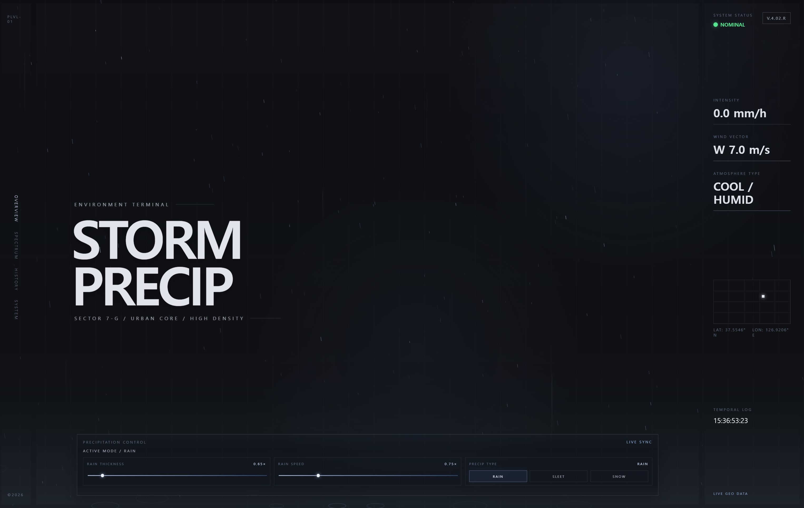

# STORM-PRECIP

**Environment Terminal Interface for Real-Time Precipitation Visualization**

강수·바람·대기 상태를 터미널형 UI로 보여 주는 **React + Vite** 단일 페이지 앱입니다.  
브라우저 위치와 날씨 API를 바탕으로 데이터를 읽고, 캔버스로 비·진눈깨비·눈을 시뮬레이션합니다.

## 기능

- **Overview** — 히어로 화면, 강수 강도·속도·유형 제어, 패럴럭스
- **Spectrum** — 환경 지표 기반 스펙트럼 그래프
- **History** — 환경 스냅샷 타임라인(로컬 저장, 수동 캡처)
- **System** — 입자·바람·난류 등 고급 파라미터, 프리셋, 설정 `localStorage` 유지

## 기술 스택

- React 18, Vite 5
- Canvas 2D 강수 렌더링, CSS 글래스/그리드 UI

## 시작하기

```bash
npm install
npm run dev
```

브라우저에서 표시되는 주소(기본 `http://localhost:5173`)로 접속합니다.

| 명령 | 설명 |
|------|------|
| `npm run dev` | 개발 서버 |
| `npm run build` | 프로덕션 빌드 (`dist/`) |
| `npm run preview` | 빌드 결과 미리보기 |

위치 권한을 허용하면 좌표 기반으로 [Open-Meteo](https://open-meteo.com/) 예보 API를 호출합니다(별도 API 키 없음). 요청 URL·필드는 `src/services/weatherService.js`에서 정의합니다.

## 미리보기



## 구조 개요

```
src/
├── App.jsx, main.jsx
├── components/     # rain(캔버스·히어로), spectrum, history, system, right-panel
├── hooks/            # 날씨, 위치, 활성 뷰, 시스템 설정, 히스토리 등
├── services/         # weather, location
├── utils/            # 환경 매핑, 시스템 설정 저장
└── assets/           # 이미지 등 정적 자산
```
